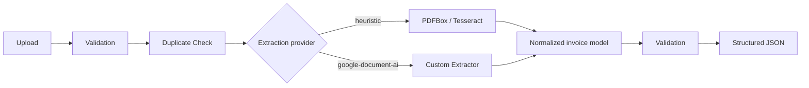

# InvoiceParse Java

A Java/Spring Boot parser that turns invoices, purchase orders, sales orders, and purchase bills into normalized JSON. It supports two extraction providers: the original local PDFBox/Tesseract heuristic pipeline and an opt-in Google Document AI Custom Extractor. Both providers feed the same validation, confidence, persistence, API, and review UI layers.

The project includes a responsive React review client with drag-and-drop upload, extraction confidence, line items, validation results, warnings, and JSON export.

This is an accounting-document baseline intended for evaluation and extension. It is not a production-grade universal document parser, and extraction accuracy depends on document quality, OCR quality, and layout.

## Features

- Multipart upload for PDF, PNG, JPG, and JPEG, validated by file signature rather than the claimed MIME type
- PDFBox text extraction and positional token capture for digital PDFs
- Page rendering plus local Tesseract OCR for scanned PDFs; direct OCR for images
- Generic label aliases and regex extraction, with no supplier-specific templates
- Google Document AI Custom Extractor integration with nested line-item mapping and Application Default Credentials
- Classification for invoices, purchase orders, sales orders, and purchase bills
- Line-item detection for common pharmaceutical and general accounting columns, including serial number, free quantity, pack, batch, expiry, HSN, MRP, rate, discount, split GST, and amount
- GSTIN, date, numeric, non-negative value, line-total, and invoice-total validation
- Field/source-informed confidence, expected-field coverage, warnings, and a manual-review flag
- Conservative review safeguards when GSTINs are expected but missing or invoice arithmetic is inconsistent
- Configurable hard timeout for every Tesseract page process
- SHA-256 duplicate detection backed by PostgreSQL
- Flyway migrations, Actuator health, OpenAPI/Swagger UI, Docker, and Docker Compose
- Synthetic sample invoices and expected result fixtures
- Portfolio-ready React UI for uploading and reviewing parsed invoices

## Processing flow



The implementation separates file detection, extraction-provider selection, cloud response mapping, local OCR, validation, orchestration, and persistence. Set `INVOICE_EXTRACTION_PROVIDER=google-document-ai` to bypass the manual header/table heuristics. PDFBox is still used locally for file safety checks and to distinguish digital from scanned PDFs, but Google performs OCR and semantic extraction.

## Technology choices

- Java 21 and Spring Boot 3
- Maven
- Apache PDFBox 3
- Tesseract 5 through a small process adapter (no native JNI/JNA coupling)
- Google Cloud Document AI Java client, using a configured Custom Extractor processor
- PostgreSQL 16 and Flyway
- JUnit 5, AssertJ, MockMvc, H2 in PostgreSQL compatibility mode
- Docker Compose for a reproducible application/database stack

OpenCV is intentionally omitted: the high-contrast baseline samples do not need image preprocessing, and adding a large native dependency would not materially improve this MVP. An image-preprocessing interface is a natural next step for deskewing, denoising, and adaptive thresholding.

## Quick start with Docker

Prerequisite: Docker with Compose.

```bash
docker compose up --build
```

Wait for both services to become healthy, then open:

- Web client: <http://localhost:8080>
- Health: <http://localhost:8080/actuator/health>
- Swagger UI: <http://localhost:8080/swagger-ui.html>
- OpenAPI JSON: <http://localhost:8080/v3/api-docs>

Data is kept in the `invoiceparse-postgres` named volume. The Compose credentials are deliberately local development defaults; change them for any shared environment.

## Public demo on Google Cloud Run

The `demo` Spring profile is intended for an unauthenticated portfolio deployment. It uses an in-memory H2 database instead of PostgreSQL, discards original uploads, expires extracted results after one hour, disables API documentation, adds browser security headers, and limits traffic and document complexity. Data also disappears whenever Cloud Run replaces or scales down the container.

After selecting a Google Cloud project with billing enabled, deploy the repository-root Dockerfile with:

```bash
gcloud run deploy invoiceparse-demo \
  --source . \
  --region northamerica-northeast2 \
  --allow-unauthenticated \
  --cpu 1 \
  --memory 2Gi \
  --concurrency 1 \
  --min 0 \
  --max 1 \
  --timeout 180s \
  --cpu-boost \
  --set-env-vars SPRING_PROFILES_ACTIVE=demo
```

The recommended single-instance and single-concurrency settings bound OCR resource use and match the application's demo request guard. Set a Google Cloud budget alert before sharing the URL publicly. The demo UI includes a bundled synthetic invoice so visitors do not need to upload a real document.

## Upload a document

The API accepts one multipart field named `file`:

```bash
curl --fail --silent \
  -F "file=@samples/digital-invoice-layout-a.pdf" \
  http://localhost:8080/api/v1/documents/parse
```

Upload it a second time to see `duplicate: true`. The existing parsed record is returned with the same `documentId`; the filename reflects the newest upload.

Example (abbreviated) response:

```json
{
  "documentId": "7cc52f4b-996f-43ac-a865-a662fd30596e",
  "originalFilename": "digital-invoice-layout-a.pdf",
  "fileHash": "8fa1...",
  "duplicate": false,
  "documentType": "INVOICE",
  "sourceType": "DIGITAL_PDF",
  "pageCount": 1,
  "documentNumber": "SI-2026-104",
  "documentDate": "2026-08-07",
  "invoiceNumber": "SI-2026-104",
  "invoiceDate": "2026-08-07",
  "supplierName": "Example Components Pvt Ltd",
  "supplierGstin": "27ABCDE1234F1Z5",
  "customerName": "Sample Retail LLP",
  "customerGstin": "29PQRSX5678K1Z2",
  "supplierAddress": "10 Demo Park, Pune, Maharashtra",
  "customerAddress": null,
  "subtotal": null,
  "discount": null,
  "cgst": 144.00,
  "sgst": 144.00,
  "igst": null,
  "taxableAmount": 1600.00,
  "roundOff": null,
  "grandTotal": 1888.00,
  "currency": "INR",
  "lineItems": [
    {
      "productName": "Copper Cable",
      "description": "Copper Cable",
      "hsnSac": "8544",
      "quantity": 2,
      "unit": "roll",
      "unitRate": 500.00,
      "gstPercentage": 18,
      "taxableAmount": 1000.00,
      "lineTotal": 1000.00,
      "confidence": 0.82
    }
  ],
  "validationResults": [
    {"code":"INVOICE_TOTAL","field":"grandTotal","valid":true,"message":"Invoice total is consistent"}
  ],
  "fieldConfidences": {"invoiceNumber":0.92,"grandTotal":0.92},
  "overallConfidence": 0.95,
  "manualReviewRequired": false,
  "warnings": []
}
```

Optional fields remain present as JSON `null`. Invalid extracted values normally create a validation result, warning, and manual-review flag instead of failing the request. For GST invoices, an expected but unreadable GSTIN is represented by `0.0` in `fieldConfidences` and forces review; high average OCR confidence does not override missing expected fields or failed arithmetic. Invalid files, OCR execution failures/timeouts, and unreadable content use a consistent error shape with `timestamp`, HTTP `status`, machine-readable `code`, `message`, `path`, and `details`.

## Google Document AI Custom Extractor

The integration is implemented but intentionally disabled until a GCP processor is configured. Create the processor schema using [docs/google-document-ai-schema.md](docs/google-document-ai-schema.md); field names are part of the application contract, especially the repeated `line_items` parent and its child fields.

For local development, authenticate with Google Application Default Credentials and set:

```bash
gcloud auth application-default login
export INVOICE_EXTRACTION_PROVIDER=google-document-ai
export GOOGLE_CLOUD_PROJECT=your-project-id
export DOCUMENT_AI_LOCATION=us
export DOCUMENT_AI_PROCESSOR_ID=your-processor-id
# Optional: pin an evaluated version instead of using the processor's default version.
export DOCUMENT_AI_PROCESSOR_VERSION=your-processor-version
mvn spring-boot:run
```

On Cloud Run, use a dedicated service account with permission to process documents. Application Default Credentials are supplied by the runtime, so do not package a service-account key in the image. Configure the same environment variables on the service and grant access to the processor.

The Google provider sends the original bytes and detected MIME type to the regional `processDocument` endpoint. It maps entity mention text, normalized values, nested line items, field confidence, and page count into the existing API model. Missing essential fields, invalid normalized dates or numbers, invalid GSTINs, and inconsistent totals force manual review instead of silently accepting the result.

Duplicate-result caching is namespaced by provider and Document AI processor/version. Uploading a file previously parsed by the heuristic provider therefore still invokes Google once Google mode is enabled.

The application does not automatically create, train, deploy, or mutate a processor. Those are privileged setup operations and should be performed explicitly when the GCP project is configured.

## Local development

Prerequisites:

- JDK 21
- Maven 3.9+
- PostgreSQL 14+
- Tesseract 5 with English language data

Create the database and export overrides if they differ from the defaults:

```bash
export DATABASE_URL=jdbc:postgresql://localhost:5432/invoiceparse
export DATABASE_USERNAME=invoiceparse
export DATABASE_PASSWORD=invoiceparse
mvn spring-boot:run
```

Run the React client in a second terminal. Its development server proxies API and health requests to Spring Boot:

```bash
cd frontend
npm install
npm run dev
```

Open <http://localhost:5173>. A production frontend build can be created with `npm run build`; the Docker image performs this build automatically and packages it into the Spring Boot application.

Important configuration variables:

| Variable | Default | Purpose |
|---|---:|---|
| `INVOICE_EXTRACTION_PROVIDER` | `heuristic` | `heuristic` or `google-document-ai` |
| `GOOGLE_CLOUD_PROJECT` | — | GCP project containing the Custom Extractor |
| `DOCUMENT_AI_LOCATION` | `us` | Processor region and API endpoint prefix |
| `DOCUMENT_AI_PROCESSOR_ID` | — | Custom Extractor processor ID |
| `DOCUMENT_AI_PROCESSOR_VERSION` | — | Optional pinned processor version; blank uses the default version |
| `MAX_UPLOAD_SIZE` | `15MB` | Multipart file/request limit |
| `MINIMUM_TEXT_CHARACTERS_PER_PAGE` | `40` | Digital-PDF text-layer threshold |
| `PDF_RENDER_DPI` | `250` | Scanned-PDF OCR render resolution |
| `TESSERACT_COMMAND` | `tesseract` | Executable name or path |
| `TESSERACT_LANGUAGE` | `eng` | Installed Tesseract language |
| `OCR_TIMEOUT_SECONDS` | `60` | Hard limit for each page OCR process |
| `MINIMUM_OVERALL_CONFIDENCE` | `0.70` | Manual-review threshold |
| `TOTAL_TOLERANCE` | `0.10` | Allowed arithmetic difference |
| `MAXIMUM_PDF_PAGES` | `25` | Maximum accepted PDF page count (`3` in the demo profile) |
| `MAX_UPLOAD_SIZE` | `5MB` in demo | Maximum uploaded file size for the public demo |
| `MAX_REQUEST_SIZE` | `6MB` in demo | Multipart request ceiling, including upload framing |
| `MAXIMUM_IMAGE_PIXELS` | `40000000` | Maximum decoded image or rendered-page pixel count (`12000000` in demo) |
| `MAXIMUM_IMAGE_DIMENSION` | `12000` | Maximum image width or height in pixels (`6000` in demo) |
| `RESULT_RETENTION_MINUTES` | `0` | Parsed-result lifetime; `0` retains results, while demo defaults to `60` |
| `DEMO_ACCESS_ENABLED` | `false` | Enables the in-process public-demo traffic guard |
| `DEMO_RATE_WINDOW_SECONDS` | `600` | Demo rate-limit window |
| `DEMO_MAX_REQUESTS_PER_CLIENT` | `5` | Requests allowed per client in each demo window |
| `DEMO_MAX_REQUESTS_GLOBAL` | `30` | Requests allowed globally in each demo window |
| `DEMO_MAX_CONCURRENT_REQUESTS` | `1` | Concurrent demo parses before new requests receive `503` |

The default heuristic provider requires no API key or paid cloud service. Google mode uses Application Default Credentials and incurs Document AI charges. Neither provider logs extracted document text.

## Samples

- `samples/digital-invoice-layout-a.pdf`: text-layer GST invoice with pipe-separated columns
- `samples/image-invoice-layout-b.png`: raster invoice with a different, whitespace-aligned layout
- `samples/expected/`: complete expected response shapes; runtime-generated IDs, hashes, confidence, and validation detail can vary and are represented as `null` where appropriate

All names, addresses, identifiers, and transactions are synthetic. Regenerate both files after editing the fixture source with:

```bash
java -Djava.awt.headless=true tools/SampleInvoiceGenerator.java
```

## Testing

```bash
mvn test
```

The suite covers digital/scanned PDF routing, signature validation, document classification, party-role assignment, GSTIN validation, date and amount normalization, general and pharmaceutical line-item layouts, free quantities, watermark-interrupted rows, line/invoice total validation, OCR timeout enforcement, confidence/review regression cases, API errors, persistence, and duplicate detection. The Docker smoke test described under Quick start exercises real PostgreSQL and Tesseract.

The GitHub Actions workflow in `.github/workflows/ci.yml` runs `mvn test` on Java 21 for every push and pull request.

## Project structure

```text
src/main/java/com/invoiceparse/
├── api/          HTTP DTOs, controller, and error mapping
├── config/       typed runtime configuration
├── exception/    processing exceptions
├── extract/      PDF/OCR/content/header/table extraction
├── model/        source and positional text models
├── persistence/  JPA duplicate records
├── service/      end-to-end orchestration
└── validation/   GSTIN and arithmetic validation
src/main/resources/db/migration/  Flyway schema
src/test/                       unit and HTTP integration tests
frontend/                       React + TypeScript review client
samples/                        generated synthetic documents/results
tools/                          dependency-free sample generator
```

## Current limitations

- The parser recognizes `INVOICE`, `PURCHASE_ORDER`, `SALES_ORDER`, and `PURCHASE_BILL`; unrelated document families remain `UNKNOWN`.
- Google mode requires a deployed and evaluated Custom Extractor. Unit tests validate response mapping without making billable API calls; real accuracy cannot be measured until the processor is configured and evaluated on held-out documents.
- The public `demo` profile is intentionally ephemeral and single-instance. Durable duplicate history remains available only in the normal PostgreSQL profile.
- Generic regex and row heuristics work best on conventional labels. A header-derived pharmaceutical-table path supports the included serial-numbered order/bill layouts; unrelated rich layouts may still need delimiters or future geometric reconstruction.
- Positional tokens are retained, but robust geometric table reconstruction and cross-page table stitching are future work.
- OCR uses English data and no deskew/denoise stage by default. Install/configure additional Tesseract languages as needed.
- GSTIN validation checks the official-looking 15-character structure, not registration existence or checksum ownership.
- Duplicate identity is byte-for-byte SHA-256; visually identical re-encoded files are not treated as duplicates.
- Processing is synchronous and stores parsed JSON, not original documents. There is no authentication, tenant isolation, job queue, or review UI.

## Future improvements

- Geometric row/column reconstruction from the retained bounding boxes
- OpenCV preprocessing selected by image-quality metrics
- Mixed digital/scanned page handling and multi-page table continuation
- Per-field bounding-box provenance and multi-document processor routing
- Async batch processing, object storage, observability, and a manual-review workflow
- International tax identifiers, currencies, locales, and learned layout models

Licensed under the [MIT License](LICENSE).
