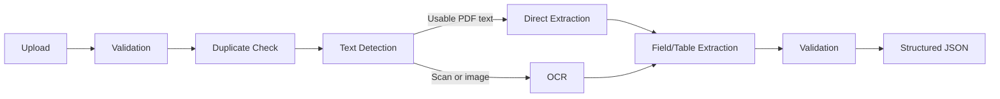

# InvoiceParse Java

A local-first Java/Spring Boot MVP that turns invoice PDFs and images into normalized JSON. It detects usable PDF text, falls back to Tesseract for scanned content, extracts common header fields and basic line-item tables, validates arithmetic, and records SHA-256 hashes to identify duplicate uploads.

The project includes a responsive React review client with drag-and-drop upload, extraction confidence, line items, validation results, warnings, and JSON export.

This is an honest invoice-focused baseline intended for evaluation and extension. It is not a production-grade universal document parser, and extraction accuracy depends on document quality, OCR quality, and layout.

## Features

- Multipart upload for PDF, PNG, JPG, and JPEG, validated by file signature rather than the claimed MIME type
- PDFBox text extraction and positional token capture for digital PDFs
- Page rendering plus local Tesseract OCR for scanned PDFs; direct OCR for images
- Generic label aliases and regex extraction, with no supplier-specific templates
- Basic line-item detection for common Description/Product, Quantity, Rate, Tax, and Amount columns
- GSTIN, date, numeric, non-negative value, line-total, and invoice-total validation
- Field/source-informed confidence, expected-field coverage, warnings, and a manual-review flag
- Conservative review safeguards when GSTINs are expected but missing or invoice arithmetic is inconsistent
- Configurable hard timeout for every Tesseract page process
- SHA-256 duplicate detection backed by PostgreSQL
- Flyway migrations, Actuator health, OpenAPI/Swagger UI, Docker, and Docker Compose
- Synthetic sample invoices and expected result fixtures
- Portfolio-ready React UI for uploading and reviewing parsed invoices

## Processing flow



The implementation separates file detection, content extraction, OCR, field extraction, table extraction, validation, orchestration, and persistence. `OcrEngine` is the provider boundary: a later Textract or Document AI adapter can replace the local CLI implementation without changing parsing or API code. Both PDFBox and Tesseract results retain page and bounding-box token data, although this MVP's table fallback is primarily text-row based.

## Technology choices

- Java 21 and Spring Boot 3
- Maven
- Apache PDFBox 3
- Tesseract 5 through a small process adapter (no native JNI/JNA coupling)
- PostgreSQL 16 and Flyway
- JUnit 5, AssertJ, MockMvc, H2 in PostgreSQL compatibility mode
- Docker Compose for a reproducible application/database stack

OpenCV is intentionally omitted: the high-contrast baseline samples do not need image preprocessing, and adding a large native dependency would not materially improve this MVP. An image-preprocessing interface is a natural next step for deskewing, denoising, and adaptive thresholding.

## Quick start with Docker

Prerequisite: Docker with Compose.

```bash
docker compose up --build
```

Wait for both services to become healthy, then open:

- Web client: <http://localhost:8080>
- Health: <http://localhost:8080/actuator/health>
- Swagger UI: <http://localhost:8080/swagger-ui.html>
- OpenAPI JSON: <http://localhost:8080/v3/api-docs>

Data is kept in the `invoiceparse-postgres` named volume. The Compose credentials are deliberately local development defaults; change them for any shared environment.

## Upload an invoice

The API accepts one multipart field named `file`:

```bash
curl --fail --silent \
  -F "file=@samples/digital-invoice-layout-a.pdf" \
  http://localhost:8080/api/v1/documents/parse
```

Upload it a second time to see `duplicate: true`. The existing parsed record is returned with the same `documentId`; the filename reflects the newest upload.

Example (abbreviated) response:

```json
{
  "documentId": "7cc52f4b-996f-43ac-a865-a662fd30596e",
  "originalFilename": "digital-invoice-layout-a.pdf",
  "fileHash": "8fa1...",
  "duplicate": false,
  "documentType": "INVOICE",
  "sourceType": "DIGITAL_PDF",
  "pageCount": 1,
  "invoiceNumber": "SI-2026-104",
  "invoiceDate": "2026-08-07",
  "supplierName": "Example Components Pvt Ltd",
  "supplierGstin": "27ABCDE1234F1Z5",
  "customerName": "Sample Retail LLP",
  "customerGstin": "29PQRSX5678K1Z2",
  "address": "10 Demo Park, Pune, Maharashtra",
  "subtotal": null,
  "discount": null,
  "cgst": 144.00,
  "sgst": 144.00,
  "igst": null,
  "taxableAmount": 1600.00,
  "roundOff": null,
  "grandTotal": 1888.00,
  "currency": "INR",
  "lineItems": [
    {
      "productName": "Copper Cable",
      "description": "Copper Cable",
      "hsnSac": "8544",
      "quantity": 2,
      "unit": "roll",
      "unitRate": 500.00,
      "gstPercentage": 18,
      "taxableAmount": 1000.00,
      "lineTotal": 1000.00,
      "confidence": 0.82
    }
  ],
  "validationResults": [
    {"code":"INVOICE_TOTAL","field":"grandTotal","valid":true,"message":"Invoice total is consistent"}
  ],
  "fieldConfidences": {"invoiceNumber":0.92,"grandTotal":0.92},
  "overallConfidence": 0.95,
  "manualReviewRequired": false,
  "warnings": []
}
```

Optional fields remain present as JSON `null`. Invalid extracted values normally create a validation result, warning, and manual-review flag instead of failing the request. For GST invoices, an expected but unreadable GSTIN is represented by `0.0` in `fieldConfidences` and forces review; high average OCR confidence does not override missing expected fields or failed arithmetic. Invalid files, OCR execution failures/timeouts, and unreadable content use a consistent error shape with `timestamp`, HTTP `status`, machine-readable `code`, `message`, `path`, and `details`.

## Local development

Prerequisites:

- JDK 21
- Maven 3.9+
- PostgreSQL 14+
- Tesseract 5 with English language data

Create the database and export overrides if they differ from the defaults:

```bash
export DATABASE_URL=jdbc:postgresql://localhost:5432/invoiceparse
export DATABASE_USERNAME=invoiceparse
export DATABASE_PASSWORD=invoiceparse
mvn spring-boot:run
```

Run the React client in a second terminal. Its development server proxies API and health requests to Spring Boot:

```bash
cd frontend
npm install
npm run dev
```

Open <http://localhost:5173>. A production frontend build can be created with `npm run build`; the Docker image performs this build automatically and packages it into the Spring Boot application.

Important configuration variables:

| Variable | Default | Purpose |
|---|---:|---|
| `MAX_UPLOAD_SIZE` | `15MB` | Multipart file/request limit |
| `MINIMUM_TEXT_CHARACTERS_PER_PAGE` | `40` | Digital-PDF text-layer threshold |
| `PDF_RENDER_DPI` | `250` | Scanned-PDF OCR render resolution |
| `TESSERACT_COMMAND` | `tesseract` | Executable name or path |
| `TESSERACT_LANGUAGE` | `eng` | Installed Tesseract language |
| `OCR_TIMEOUT_SECONDS` | `60` | Hard limit for each page OCR process |
| `MINIMUM_OVERALL_CONFIDENCE` | `0.70` | Manual-review threshold |
| `TOTAL_TOLERANCE` | `0.10` | Allowed arithmetic difference |

No API keys or paid cloud services are required. The service does not log extracted document text.

## Samples

- `samples/digital-invoice-layout-a.pdf`: text-layer GST invoice with pipe-separated columns
- `samples/image-invoice-layout-b.png`: raster invoice with a different, whitespace-aligned layout
- `samples/expected/`: complete expected response shapes; runtime-generated IDs, hashes, confidence, and validation detail can vary and are represented as `null` where appropriate

All names, addresses, identifiers, and transactions are synthetic. Regenerate both files after editing the fixture source with:

```bash
java -Djava.awt.headless=true tools/SampleInvoiceGenerator.java
```

## Testing

```bash
mvn test
```

The suite covers digital/scanned PDF routing, signature validation, GSTIN validation, date and amount normalization, header extraction, two line-item layouts, constrained numeric-tail behavior, line/invoice total validation, OCR timeout enforcement, confidence/review regression cases, API errors, persistence, and duplicate detection. The Docker smoke test described under Quick start exercises real PostgreSQL and Tesseract.

The GitHub Actions workflow in `.github/workflows/ci.yml` runs `mvn test` on Java 21 for every push and pull request.

## Project structure

```text
src/main/java/com/invoiceparse/
├── api/          HTTP DTOs, controller, and error mapping
├── config/       typed runtime configuration
├── exception/    processing exceptions
├── extract/      PDF/OCR/content/header/table extraction
├── model/        source and positional text models
├── persistence/  JPA duplicate records
├── service/      end-to-end orchestration
└── validation/   GSTIN and arithmetic validation
src/main/resources/db/migration/  Flyway schema
src/test/                       unit and HTTP integration tests
frontend/                       React + TypeScript review client
samples/                        generated synthetic documents/results
tools/                          dependency-free sample generator
```

## Current limitations

- The parser recognizes invoices only; `documentType` is `INVOICE` or `UNKNOWN` rather than a broad document classifier.
- Generic regex and row heuristics work best on conventional labels and clean, single-line item rows. The undelimited numeric-tail fallback is intentionally limited to Description/Quantity/Rate/Total rows with consistent arithmetic; richer layouts need recoverable delimiters or future geometric reconstruction.
- Positional tokens are retained, but robust geometric table reconstruction and cross-page table stitching are future work.
- OCR uses English data and no deskew/denoise stage by default. Install/configure additional Tesseract languages as needed.
- GSTIN validation checks the official-looking 15-character structure, not registration existence or checksum ownership.
- Duplicate identity is byte-for-byte SHA-256; visually identical re-encoded files are not treated as duplicates.
- Processing is synchronous and stores parsed JSON, not original documents. There is no authentication, tenant isolation, job queue, or review UI.

## Future improvements

- Geometric row/column reconstruction from the retained bounding boxes
- OpenCV preprocessing selected by image-quality metrics
- Mixed digital/scanned page handling and multi-page table continuation
- Pluggable cloud OCR adapters, document classifiers, and per-field provenance
- Async batch processing, object storage, observability, and a manual-review workflow
- International tax identifiers, currencies, locales, and learned layout models

Licensed under the [MIT License](LICENSE).
